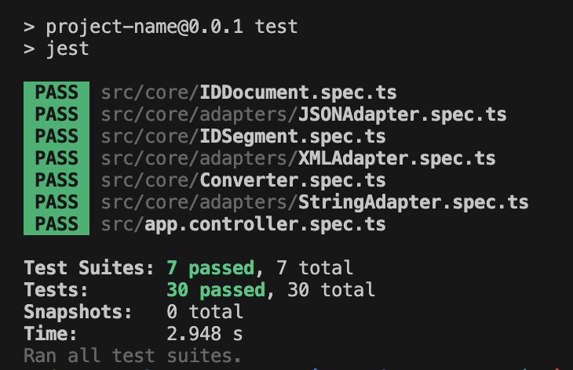

# Document Converter
Author: Pengfei Wang
- String to JSON

- String to XML


## How to run
This converter is built with Nest.JS.
1. run `npm install`
2. run `npm start`
3. send a HTTP POST request to `localhost:3000`
    ```
    POST http://localhost:3000 HTTP/1.1
    content-type: application/json

    {
        "doc": "ProductID,4,8,15,16,23;\nProductID,a,b,c,d,e;\nAddressID,42,108,3,14;\nContactID,59,26;",
        "from": "string",
        "to": "json",
        "lineDelimiter": ";",
        "elementDelimiter": ","
    }
    ```

## About the code
- All the business logics(format conversion) are in the `core` module.
    - The `core` follows the principle of Clean Architecture. 
    - The `core` should be independent from any external system like framework and database.
    - The `core` should be well tested.
    - The `core` module only expose 4 things(src/core/index.ts) to the outside world: **Converter**, **AdapterFactory**, **DocumentFormat** and **InvalidDocumentError**. All the rest of implementation details are hidden.
    - The **IDDocument** class in `src/core/IDDocument.ts` is the domain model.
- The Nest.JS part is kept minimum with only pluming and serve the REST API.
    - It doesn't have any business logic.
    - The tests only testing if the pluming works.

## Add a new format with just 2 steps:
1. Add a new class with implements the **Adapter** interface(src/core/adapters/Adapter.interface.ts).
2. Update the factory(src/core/adapters/Factory.ts)

## Further enhancements should be done
These are the things I would like to do if I have more time.
- Refactor the **Converter** class to hide the **AdapterFactory**. It will make the core even more concise.
- The Nest.JS part should catch the **InvalidDocumentError** from the core and return a HTTP 400 instead of HTTP 500.
- The `core` should throw a **InvalidDocumentError** from the adapters if the JSON or XML format is invalid.

## Tests
There are **30** test cases in total and **29** of them are in the `core` module.
- Run `npm run test`
- Here is the result:

